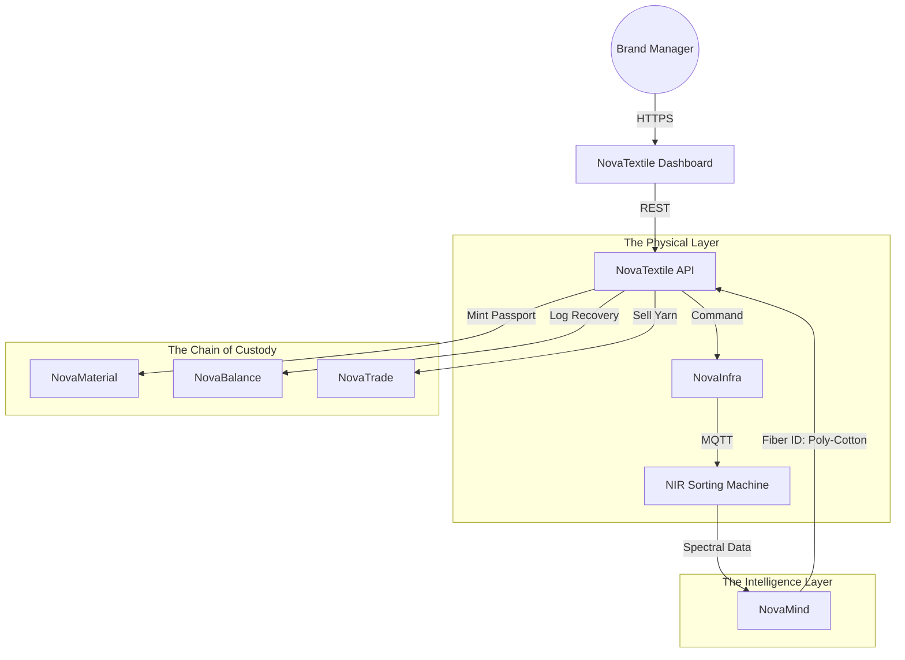

# 🧶 NovaTextile

> **The Operating System for Circular Fashion.**
> Management of textile lifecycles, sustainable sourcing, and fiber-to-fiber recycling loops.

[](https://www.google.com/search?q=https://github.com/novaeco-tech/novatextile/actions)
[](https://opensource.org/licenses/MIT)
[](https://www.google.com/search?q=https://textiles.novaeco.tech)

**NovaTextile** is the Vertical Sector dedicated to closing the loop on fashion. While `NovaRetail` handles the consumer transaction (buying/selling), **NovaTextile** handles the **Material Engineering** of the loop. It connects Brands, Sorters, and Recyclers to ensure that old shirts become new yarn, not landfill.

It provides the infrastructure for the **EU Digital Product Passport (DPP)** specific to garments.

-----

## 🎯 Value Proposition

The fashion industry produces 92 million tons of waste annually. **NovaTextile** solves the data gaps that prevent recycling:

1.  **Composition Truth:** Tracking exact fiber blends (e.g., "60% Cotton / 40% Elastane") to determine recyclability.
2.  **Automated Sorting:** Integrating with sorting centers to direct garments to **Mechanical Recycling** (cutting), **Chemical Recycling** (dissolving), or **Re-wear**.
3.  **Regulatory Compliance:** ensuring brands meet the **Extended Producer Responsibility (EPR)** targets mandated by the EU.

-----

## 🏗️ Architecture (The Digital Thread)

NovaTextile acts as the domain controller for fiber data. It relies on `NovaMaterial` for the base passport structure but adds textile-specific logic (e.g., yarn spinning data, dye toxicity).



### Integrated Services

  * **[NovaMaterial](https://www.google.com/search?q=https://materials.novaeco.tech):** Stores the immutable Digital Product Passport (DPP). NovaTextile enriches this with fashion-specific metadata (season, dye lot, weave type).
  * **[NovaMind](https://www.google.com/search?q=https://mind.novaeco.tech):** The sorting brain. Analyzes data from Near-Infrared (NIR) sensors to identify fiber composition in fraction of a second.
  * **[NovaRecycle](https://www.google.com/search?q=https://recycling.novaeco.tech):** Manages the physical facility where sorting happens. NovaTextile provides the *logic* for the sorting machines.
  * **[NovaTrade](https://www.google.com/search?q=https://trade.novaeco.tech):** The marketplace where "Recycled Pulp" or "Reclaimed Yarn" is sold back to brands.

-----

## ✨ Key Features

### 1\. The Fiber-to-Fiber Orchestrator

Connects the downstream recycler with the upstream designer.

  * **Input:** 10 tons of "Post-Consumer Waste" collected via `NovaLogistics`.
  * **Process:** `NovaMind` identifies 3 tons of pure white cotton.
  * **Output:** NovaTextile creates a "Raw Material Lot" in `NovaTrade` for chemical recyclers to bid on.

### 2\. DPP Generator (Fashion Edition)

A specialized tool for Fashion Designers.

  * Instead of manual data entry, it pulls data from PLM (Product Lifecycle Management) systems.
  * Generates the QR code that *must* be sewn into the garment by law.
  * **Metrics:** Calculates the "Circular Design Score" based on ease of disassembly (e.g., monomaterial vs. mixed blends).

### 3\. Chemical Management (ZDHC)

Integrates with **NovaChem** to track dyes and finishes.

  * Ensures that recycled fibers do not contain banned legacy chemicals (PFAS/heavy metals).
  * Flags batches that are unsafe for "next-to-skin" reuse.

### 4\. Brand Impact Dashboard

Real-time EPR tracking.

  * "You put 50,000 tons of polyester into the market."
  * "You successfully recovered 12,000 tons."
  * "Net Circularity Gap: 76%."

-----

## 🚀 Getting Started

We use **DevContainers** to provide a consistent development environment.

### Prerequisites

  * Docker Desktop
  * VS Code (with Remote Containers extension)

### Installation

1.  **Clone the repo:**
    ```bash
    git clone https://github.com/novaeco-tech/novatextile.git
    cd novatextile
    ```
2.  **Open in VS Code:**
      * Run `code .`
      * Click **"Reopen in Container"** when prompted.
3.  **Start the Sector:**
    ```bash
    make dev
    ```
      * **Dashboard:** http://localhost:3000
      * **API:** http://localhost:8000/docs

### Configuration (`.env`)

```ini
# Sector Config
SORTING_ALGORITHM=NIR_SPECTROSCOPY_V2
COMPLIANCE_STANDARD=EU_ECODESIGN_2026

# Integrations
NOVAMATERIAL_URL=http://novamaterial-api:8000
NOVAMIND_URL=http://novamind-api:50051
NOVACHEM_URL=http://novachem-api:8000
```

-----

## 📂 Repository Structure

```text
novatextile/
├── api/                # Python/FastAPI (Domain Logic)
│   ├── src/
│   │   ├── fibers/     # Logic for composition math (blends)
│   │   ├── dpp/        # Builders for Fashion Passports
│   │   └── sorting/    # Logic for NIR machine integration
├── app/                # React/Next.js Frontend (Brand Dashboard)
│   ├── src/
│   │   ├── designer/   # UI for creating new Passports
│   │   └── analytics/  # Circularity charts
├── website/            # Documentation (Docusaurus)
└── tests/              # Integration tests
```

-----

## 🧪 Testing

We use **Composition Simulation** for testing.

  * **Fiber Logic:** `make test-fiber`
      * Asserts that a blend of 60% Cotton + 40% Polyester is correctly flagged as "Mechanical Recycling: Difficult / Chemical Recycling: Recommended."
  * **Sorting Flow:** `make test-sort`
      * Simulates a stream of 100 garments passed to the API, verifying they are routed to the correct virtual bins based on their metadata.

-----

## 🤝 Contributing

We need contributors with backgrounds in **Textile Engineering**, **Supply Chain**, and **Standards (GS1/EPCIS)**.
See [CONTRIBUTING.md](https://www.google.com/search?q=../.github/CONTRIBUTING.md) for details.

**Maintainers:** `@novaeco-tech/maintainers-sector-novatextile`